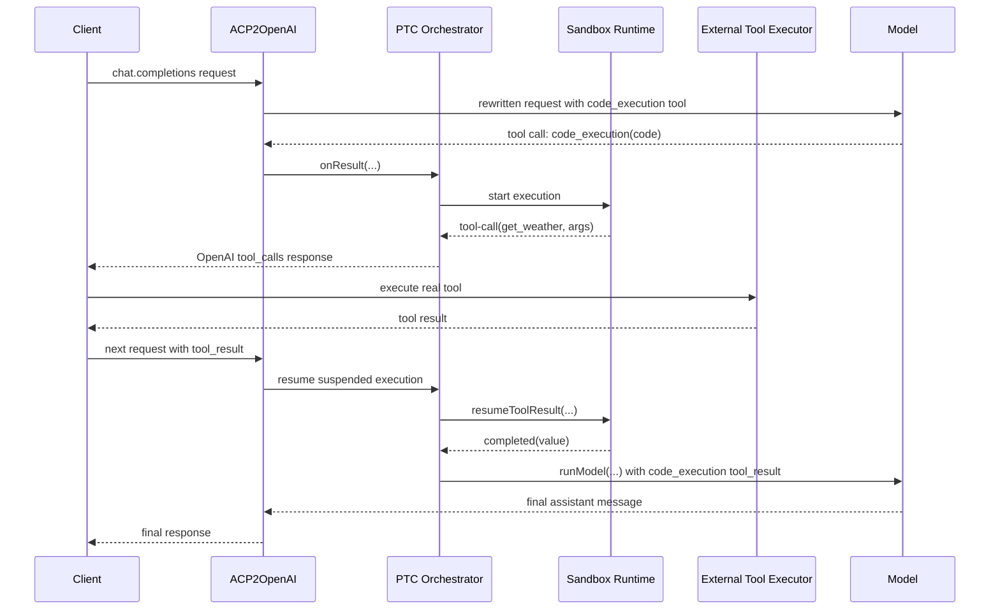

# Programmatic Tool Calling (PTC) Architecture

This document describes the architecture of **programmatic tool calling (PTC)** in `acp2openai`.

The core idea is:

- the model does **not** call every external tool directly
- the model calls one wrapper tool such as `code_execution`
- that wrapper tool runs JavaScript that can call `await tools.<name>(args)`
- each `tools.*` call is bridged back into a normal OpenAI-compatible `tool_calls` / `tool_result` round trip

In other words, the main design topic is **PTC orchestration**. The sandbox runtime is only one implementation detail inside that design. In the current architecture, that sandbox is backed by **Deno**.

## Status

- **What exists today**: PTC orchestration with a Deno-backed sandbox runtime
- **What this document defines**: the architecture of PTC as a whole
- **Current execution backend**: Deno-backed sandbox runtime

## Goals

- Preserve the OpenAI-compatible HTTP contract
- Preserve the current model-facing coding style: `await tools.<name>(args)`
- Support multi-step tool usage across multiple HTTP request/response cycles
- Keep the orchestration layer stable even if the sandbox backend changes
- Replace the in-process sandbox with a stronger isolation boundary

## Non-goals

- Solving ACP provider-specific client-tool discovery issues
- Supporting stateless multi-instance resume without sticky routing
- Serializing and restoring live suspended execution across process restarts
- Changing the external `tool_calls` / `tool_result` protocol shape

## What PTC is solving

A normal tool-calling loop expects the model to call one tool at a time and to receive the tool result immediately in the next model step.

PTC changes the interaction model:

1. the model generates JavaScript instead of directly planning every tool step in natural language
2. the JavaScript can contain variables, loops, conditionals, and multiple tool invocations
3. each `await tools.<name>(args)` must still be exposed externally as a real tool call
4. the JavaScript execution must pause until the external caller sends the matching `tool_result`
5. once the JavaScript finishes, its final value becomes the result of the original wrapper tool call

That means PTC is fundamentally a **cross-request suspend/resume orchestration problem**.

## High-level architecture

PTC is split into three layers:

1. **PTC orchestration layer**
   - lives in `createJavaScriptCodeExecutionPlugin(...)`
   - rewrites the visible tool set into a single wrapper tool such as `code_execution`
   - tracks live execution sessions across requests
   - converts internal sandbox events into OpenAI `tool_calls`
   - feeds the final execution result back into the model as a `tool_result`

2. **Execution runtime layer**
   - runs the model-generated JavaScript
   - exposes a host bridge for `tools.*` calls
   - emits `tool-call`, `completed`, or `error` events
   - can have different implementations
   - in the target architecture, this runtime is backed by Deno

3. **Session store layer**
   - keeps live execution handles in memory
   - maps `executionId` and pending `toolCallId` values to the correct suspended execution
   - handles cleanup, idle timeout, and diagnostics

## Main actors

- **Client**: sends OpenAI-compatible requests and receives OpenAI-compatible responses
- **Model**: emits the wrapper tool call with JavaScript input
- **PTC orchestrator**: manages rewrite, suspend/resume, and model continuation
- **Sandbox runtime**: executes JavaScript and reports tool-call/completed/error events
- **External tool executor**: actually runs the requested tool and sends back `tool_result`

## End-to-end PTC flow

1. A client sends `POST /v1/chat/completions`.
2. The PTC plugin rewrites the visible tools so the model sees one wrapper tool such as `code_execution`.
3. The model emits a `code_execution` tool call with JavaScript source.
4. The PTC orchestrator starts a sandbox execution session.
5. The sandbox begins running the JavaScript.
6. When the code reaches `await tools.some_tool(args)`, the sandbox runtime emits a `tool-call` event.
7. The orchestrator converts that event into a normal OpenAI `tool_calls` response.
8. The external caller executes the real tool.
9. The external caller sends a follow-up request containing the matching `tool_result`.
10. The orchestrator finds the suspended execution and resumes it.
11. Steps 6-10 repeat until the JavaScript returns a final value.
12. The final value is converted into the `tool_result` for the original `code_execution` wrapper tool.
13. The orchestrator calls `runModel(...)` again.
14. The model produces the final assistant response.

## Sequence diagram



## Model-facing programming model

The model should continue to produce code in this form:

```js
const weather = await tools.get_weather({ city: "Tokyo" });
const launches = await tools.get_launch_count({ year: 2025 });
return { weather, launches };
```

Important properties:

- the model sees a single wrapper tool, not the raw orchestration internals
- the model writes JavaScript, not a serialized plan language
- `tools.*` remains the only public abstraction for calling external tools

## Runtime contract

The PTC orchestrator should depend on a runtime interface rather than on one concrete sandbox implementation.

```ts
export interface CodeExecutionRuntimeFactory {
  createExecution(
    params: CreateExecutionParams,
  ): Promise<CodeExecutionHandle>;
}

export interface CreateExecutionParams {
  executionId: string;
  source: string;
  toolCallInput: Record<string, unknown>;
  toolNames: string[];
  sandboxGlobals?: Record<string, unknown>;
  limits: {
    maxExecutionWallTimeMs: number;
    maxToolWaitMs: number;
    maxLogs: number;
  };
}

export interface CodeExecutionHandle {
  getExecutionId(): string;
  waitForEvent(): Promise<CodeExecutionEvent>;
  resumeToolResult(params: {
    toolCallId: string;
    value: unknown;
  }): Promise<void>;
  dispose(): Promise<void>;
}

export type CodeExecutionEvent =
  | {
      type: "tool-call";
      toolCallId: string;
      toolName: string;
      args: Record<string, unknown>;
    }
  | {
      type: "completed";
      value: unknown;
      logs: string[];
      toolHistory: Array<{
        toolName: string;
        args: Record<string, unknown>;
        output: unknown;
      }>;
    }
  | {
      type: "error";
      error: Error;
    };
```

## Why the sandbox is not the architecture

The sandbox is only the **execution backend**. It is not the full PTC design.

Even if the sandbox is replaced, the following PTC responsibilities remain the same:

- rewrite the request into a wrapper tool
- keep a live execution session across HTTP requests
- translate sandbox events into OpenAI `tool_calls`
- accept a later `tool_result` request and resume execution
- run the model one more time after the wrapper tool completes

That is why the architecture should be described as **PTC first**, with the sandbox described separately as one internal component.

## Deno-backed sandbox runtime

The target runtime implementation uses a Deno subprocess sandbox.

### Why Deno is a good runtime choice

Benefits:

- strong process isolation via a dedicated Deno subprocess
- explicit permission controls such as `--allow-net` and `--allow-read`
- cleaner host-injected async handlers for `await`-based tool calls
- better process-level cleanup and observability

Trade-offs:

- requires a Deno runtime where this backend is enabled
- adds subprocess lifecycle management
- does **not** remove the need for live in-memory PTC sessions

### Deno runtime responsibilities

The Deno runtime is responsible for:

- executing the generated JavaScript
- exposing a bridge for `tools.*`
- suspending when an external tool result is required
- resuming when `resumeToolResult(...)` is called
- returning a final value or an error event

### Tool bridge design

Inside the sandbox, the host injects one internal bridge such as `__callTool(...)`. The runtime then bootstraps a public `tools` object on top of it:

```js
const tools = new Proxy({}, {
  get(_, toolName) {
    return async (args = {}) => {
      return await __callTool({ toolName: String(toolName), args });
    };
  }
});
```

This keeps the public PTC programming model stable while centralizing validation, queueing, and logging in one bridge path.

### Process model

- one `code_execution` wrapper call creates one sandbox instance
- the sandbox runs in a dedicated Deno subprocess
- the subprocess is disposed after completion or failure
- reuse is intentionally avoided to reduce state leakage risk

## State and deployment constraints

A Deno sandbox improves execution isolation, but it does **not** remove the need for live in-memory state.

The adapter must still keep:

- a live execution handle
- the mapping from `executionId` to the handle
- the mapping from pending `toolCallId` to the correct suspended call

Because of that, this design requires one of the following deployment assumptions:

- single-process deployment, or
- sticky routing so follow-up `tool_result` requests return to the same process

This design is **not** intended for fully stateless multi-instance execution without additional routing infrastructure.

## Failure model

Recommended error categories:

- `SandboxStartupError`
- `SandboxExecutionError`
- `SandboxToolWaitTimeoutError`
- `SandboxDisposedError`
- `SandboxProtocolError`

These should clearly distinguish whether the failure came from:

- model-generated JavaScript
- sandbox lifecycle failure
- missing or late `tool_result`
- invalid host/sandbox protocol messages

## Timeout model

The current single `timeoutMs` should be split conceptually into separate limits:

- `maxExecutionWallTimeMs`: total allowed wall-clock time for one execution session
- `maxToolWaitMs`: max time waiting for the next external tool result
- `sandboxStartupTimeoutMs`: max time allowed for the Deno subprocess to become ready
- `disposeGracePeriodMs`: max time to wait for orderly shutdown during cleanup

Separating these limits avoids treating normal external-tool latency as sandbox execution failure.

## Testing strategy

The runtime should be validated with a shared contract test suite that covers the Deno-backed execution path and any future runtime implementation.

Recommended cases:

- no tool calls, direct return
- one external tool call
- multiple sequential tool calls
- resume after `tool_result`
- execution timeout
- missing tool result timeout
- sandbox-thrown exception
- cleanup after completion and error

## Recommended rollout

1. Extract the runtime interface from the current implementation
2. Keep the existing runtime as the default backend during migration
3. Add the Deno runtime as a new backend behind the same runtime contract
4. Validate both runtimes against the same integration tests
5. Promote Deno to the recommended sandbox backend after operational validation

## Summary

The architecture here is **PTC architecture**, not "Deno architecture".

PTC is the orchestration model that lets a wrapper tool execute JavaScript, suspend on external tool calls, and resume across multiple HTTP requests.

Deno is the target **sandbox runtime implementation** inside that architecture.
